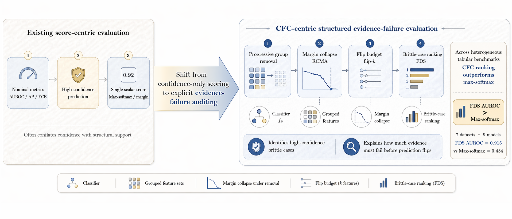
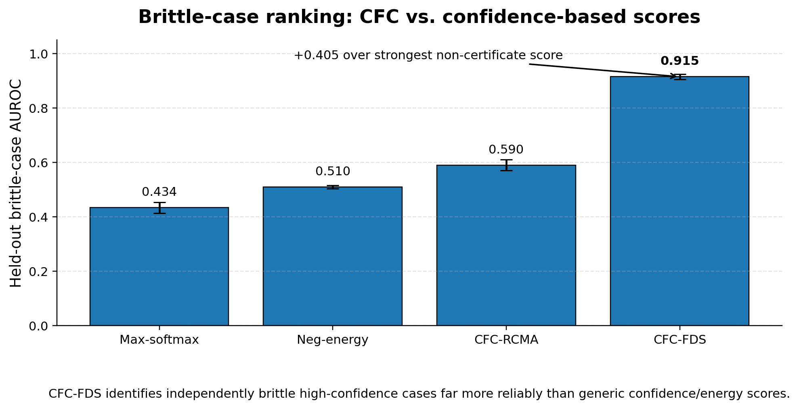

# Counterfactual Fragility Certificates — Anonymous Review Artifact

<p align="center">
  
</p>

This repository is an **anonymous review artifact** for the paper:

> **Counterfactual Fragility Certificates: Exposing High-Confidence Brittleness under Structured Evidence Failure**

CFC is a protocol-relative audit object for tabular predictions. Instead of asking only whether a prediction is confident, it asks:

> **Under a declared evidence-failure protocol, what ordered trajectory makes this prediction lose support?**

The artifact contains a compact reference implementation, precomputed result tables, selected figures, and reproduction scripts for the main audit evidence. 

---

## What is included

| Folder | Contents | Purpose |
|---|---|---|
| `src/cfc_ref/` | compact reference implementation of the CFC certificate | lets reviewers inspect the core computation |
| `data/precomputed/` | anonymous CSVs for headline tables and appendix checks | reproduces reported numbers without rerunning the full grid |
| `assets/figures/` | selected paper figures and visual summaries | makes the artifact readable and visually inspectable |
| `scripts/` | small scripts to regenerate demo certificates, tables, and figures | quick sanity checks for reviewers |
| `paper_snippets/` | core LaTeX equations | maps implementation to paper notation |
| `docs/` | GitHub Pages style artifact card | optional visual landing page |

The full production training grid is intentionally not included in this blinded artifact. This review version exposes the **auditable certificate core** and **reproduction-facing outputs** while removing author-specific paths, machine metadata, and private orchestration code. A full unblinded release will be made after review.

---

## Main result at a glance

| Ranking score | Aggregate AUROC | 95% CI | Δ vs. strongest non-certificate score |
|---|---:|---:|---:|
| Neg-energy | 0.510 | [0.504, 0.516] | best non-CFC |
| CFC-RCMA | 0.590 | [0.570, 0.610] | +0.080 |
| **CFC-FDS** | **0.915** | **[0.905, 0.925]** | **+0.405** |

Under a 20% review budget, CFC-FDS captures **88.9%** of brittle high-confidence cases, compared with **31.8–37.4%** for confidence and energy scores.

<p align="center">
  
</p>

---

## Core certificate

For a sample `x`, trained model `f`, grouped features `G`, baseline `xbar`, audit depth `K`, and degradation operators `P`, CFC stores:

```text
C(x; f, G) = (trajectory, flip_budget, RCMA, degradation_thresholds, FDS)
```

The default ranking head is fixed, not learned per dataset:

```text
FDS(x) = 1 - exp(-u(x))
u(x) = (RCMA(x) + 1 / flip_budget(x) + mean_degradation_flip_risk(x)) / 3
```

All confidence, margin, and energy baselines use a standardized probability-to-pseudo-logit conversion, making comparisons fair for neural, linear, tree-based, and boosting models.

---

## Quick start

```bash
python -m venv .venv
source .venv/bin/activate  # Windows: .venv\Scripts\activate
pip install -e . -r requirements.txt

python scripts/quick_demo.py
python scripts/reproduce_tables.py
python scripts/make_figures.py
pytest -q
```

Generated outputs are written to:

```text
results/demo_certificate.json
results/tables/tables.md
results/figures/recreated_score_comparison.png
results/figures/recreated_greedy_diagnostics.png
```

---

## Expected smoke-test output

`python scripts/quick_demo.py` prints one CFC certificate with fields:

```json
{
  "predicted_label": 1,
  "confidence": ...,
  "group_order": [...],
  "flip_budget": ...,
  "rcma": ...,
  "degradation_thresholds": {...},
  "fds": ...,
  "margins": [...]
}
```

---


Suggested initialization:

```bash
git init
git config user.name "Anonymous Authors"
git config user.email "anonymous@example.invalid"
git add .
git commit -m "anonymous review artifact"
```

---

This is a **open source artifact** containing:

- the reference CFC computation;
- the score-conversion and brittle-label protocols;
- curated precomputed tables used in the paper;
- selected figures and result recreation scripts;
- smoke tests that verify the implementation is runnable.

The paper's full grid includes heavier training, model selection, and orchestration code. 
